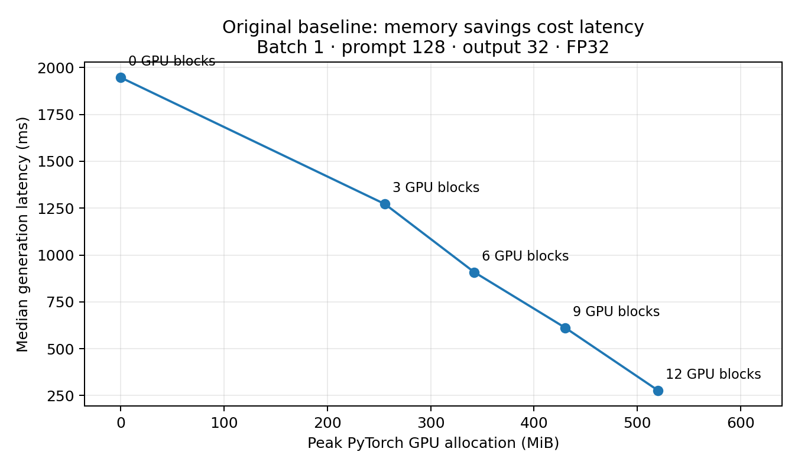

# Memory–Latency Tradeoffs in CPU–GPU Transformer Inference

**A GPT-2/T4 case study of static layer placement, frozen performance prediction, and CPU-thread sensitivity.**

This is a research-oriented experimental artifact, not a production serving engine or a claim of a new offloading algorithm. The planned study is complete: **1,060 measured generation trials** across the baseline (570), fresh-workload evaluation (230), and focused replication (260). Warmups, unit tests, and the earlier smoke run are not included in that count. These are repeated measurements, not 1,060 independent workloads.

## Results at a glance

- **Measured tradeoff:** at FP32, batch 1, prompt 128, output 32, a 6-CPU/6-GPU split reduces peak PyTorch GPU allocation by **34.2%**, but median decode time is **2.73×** GPU-only. [Baseline data](data/baseline/main/summary.csv)
- **Prediction is not decision improvement:** the compute-only and compute-plus-transfer policies match the maximum-GPU-layer policy on every tested primary decision. No placement speedup over that baseline was demonstrated. [Fresh policies](data/step3/analysis/policy_metrics.csv) · [Replication policies](data/step4/analysis/policy_metrics.csv)
- **Memory is easier to predict than time in this study:** the frozen transfer-aware predictor has median generation error **11.09%** on four fresh workload shapes. The post-hoc replication subset has **14.82%** error with two threads. Median allocation errors are **0.69%** and **0.82%**, respectively. These are different cohorts, not an isolated accuracy-degradation estimate. [Fresh results](data/step3/analysis/summary.json) · [Replication](data/step4/analysis/summary.json)
- **Conservatism has a cost:** at batch 3 / prompt 256 / output 32 / budget 640 MiB, the fixed 5% + 16 MiB guard rejects a GPU-only placement that actually fits. In the two-thread replication, it selects a placement taking **3.27×** the best measured feasible latency. No observed budget violations is not an OOM guarantee. [Scores](data/step4/analysis/policy_scores.csv)
- **Thread effects are mixed:** one thread has fewer trials exceeding 1.5× their own case/thread median (1/130 versus 17/130) in one VM, but its median generation-time ratios range from **0.905 to 1.078** relative to two threads. No universal thread-count winner or causal throttling diagnosis is established. [Comparisons](data/step4/analysis/thread_comparison.csv)



## Read first

[Technical report (PDF)](docs/technical_report.pdf) · [Report source (Markdown)](docs/technical_report.md) · [Methods and limitations](docs/METHODS.md) · [Evidence index](docs/EVIDENCE.md) · [Step 4 audit](docs/STEP4_AUDIT.md) · [Contribution disclosure](docs/CONTRIBUTIONS.md)

## Offline reproduction: no GPU or weights needed

From the repository root, with Python 3.10+ and a compatible PyTorch installation:

```bash
python -m pip install -r requirements.txt
python scripts/verify_artifact.py
python -m pytest -q
python -m pytest -q release_tests
python scripts/reproduce.py --out work/reproduction --refit
python scripts/make_figures.py
```

Install a suitable PyTorch build separately. The requirements intentionally do **not** replace a Colab CUDA build. A fresh CPU environment can install the locally tested PyTorch 2.10.0 CPU package from the official CPU wheel index:

```bash
python -m pip install torch==2.10.0 --index-url https://download.pytorch.org/whl/cpu
```

The release's offline run passed **231 existing tests**, with nine GPU-specific tests skipped. The supplied Step 4 GPU run records **240 passed**. Separate packaging tests and reproduction logs are under `release_checks/`; their counts do not represent extra GPU validation.

`reproduce.py` verifies the original archive hash, reconstructs nested inputs in a NEW working directory, reproduces Step 3/4 analysis from raw trials, and optionally refits historical models into separate folders. It does not refit the frozen published models, download GPT-2, or execute GPU inference. Reusing an output path intentionally fails.

## Prediction demonstration

```bash
python scripts/predict.py --batch 3 --prompt 256 --output 32 --budget-mib 640
```

The output is a prediction, not a measured runtime. Supported predictors are specific to GPT-2 small, FP32, prefix placement, and the recorded hardware/software regime. One-thread experiments are a deliberately changed execution condition. Output lengths other than 32 have not been prospectively validated.

## Repository map

```text
hetero/                 Manual GPT-2 forward pass, device placement, KV cache and benchmarks
offload_research/       Latency/memory models, planner and frozen experiment collectors
research_tests/        Predictor/planner/protocol tests
tests/                 Inference engine tests
models/                Unchanged frozen JSON predictors
data/baseline/          Original main/layout CSVs and metadata
data/step1/, step2/     Historical calibration and grouped validation diagnostics
data/step3/, step4/     Curated result views, predictions, gates and protocol files
data/initial_checks/   Earlier validation and copy microbenchmark, dated separately
data/archives/         Original nested run archives, retained byte-for-byte
notebooks/             Historical executable experiment notebooks
scripts/               Offline reproduction, prediction, verification and reporting
docs/                  Technical report, figures, methods, CV and release instructions
release_checks/        Audit, hashes and locally executed test/reproduction results
```

The original measured `hetero/` and `offload_research/` source files remain byte-for-byte unchanged. New documentation and offline packaging tools do not imply new GPU measurements. Curated data views are conveniences; the archives preserve full original freezes and trace data.

## Scope

The engine performs static sequential CPU/GPU block execution. There is no claimed computation overlap, weight streaming, quantization, continuous batching, padding support, or model-too-large-to-fit demonstration. It projects only the last hidden position into vocabulary logits and grows each layer's KV cache by concatenation. The model fits on the T4; memory budgets are synthetic constraints on peak PyTorch allocation, not enforced physical device caps.

The research contribution is a reproducible case study and negative policy result with a clearly separated prospective test and post-hoc robustness study. FlexGen, HeteGen and NEO investigate related but materially different systems; this repository does not benchmark against or reproduce those engines. [References](docs/REFERENCES.md)

