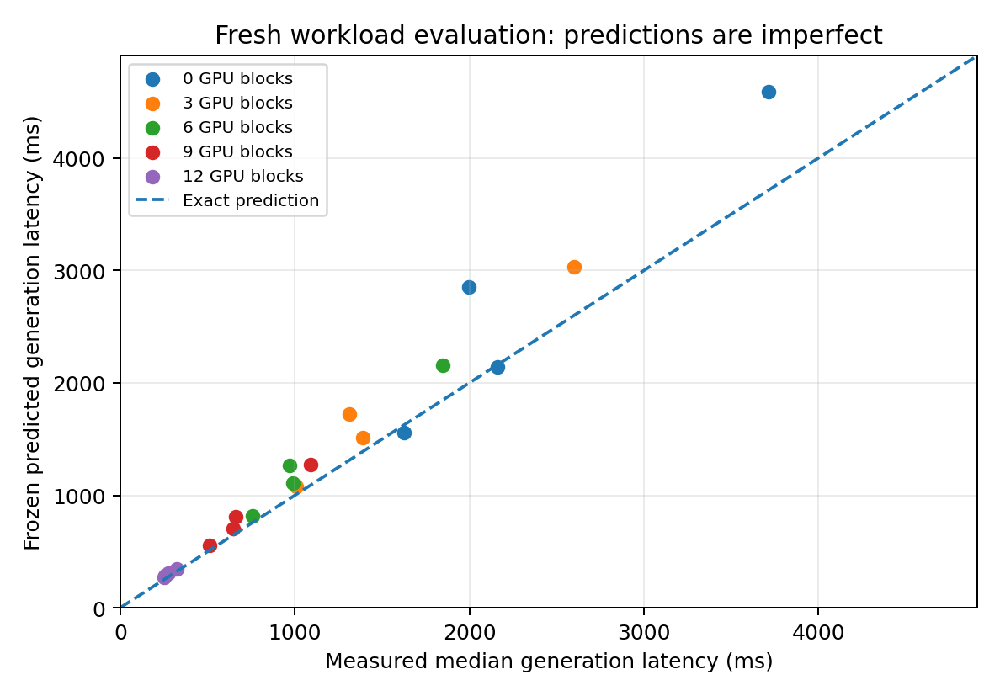
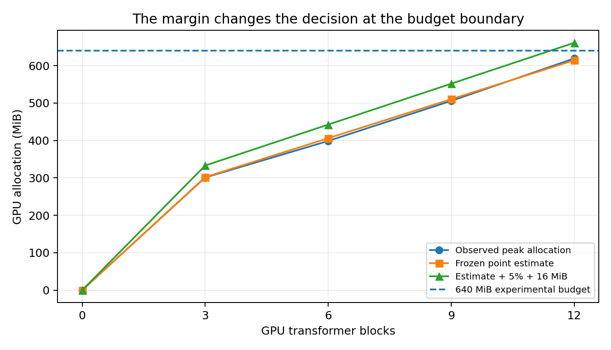
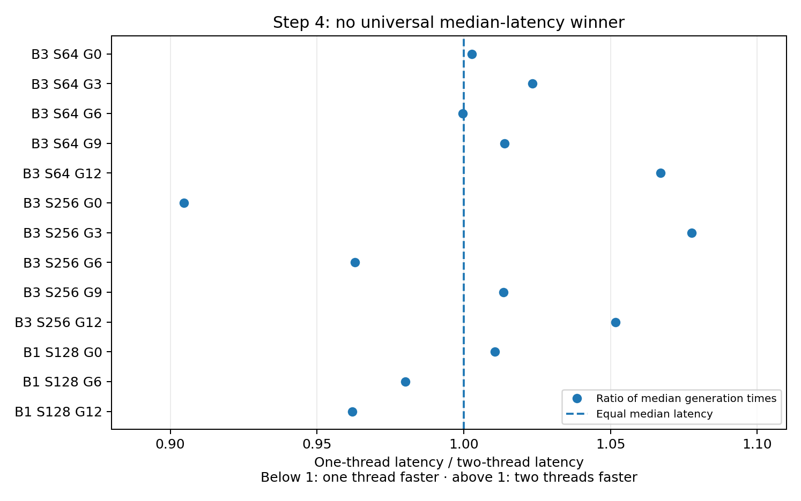

# Memory–Latency Tradeoffs in CPU–GPU Transformer Inference

Frozen prediction, budgeted placement and CPU-thread sensitivity on a single T4

Technical report · Research artifact · 21 September 2026 · Not peer reviewed

## Abstract

This study evaluates static CPU–GPU transformer placement and asks whether lightweight performance models improve placement decisions under a GPU-allocation budget. A custom FP32 GPT-2 runtime executes transformer blocks on either CPU or one NVIDIA T4, transfers activations explicitly and maintains layer-local key/value caches. The study contains 1,060 measured generations: 570 baseline/layout trials, 230 fresh-workload/control trials and 260 selected replication/thread-control trials. Frozen compute-only and transfer-aware predictors are compared with a simple maximum-GPU-layer policy using the same guarded memory filter. The transfer-aware predictor has 11.09% median generation error on four new workload shapes; median memory error is 0.69% over GPU-containing cases. However, the learned policies never select differently from the simple baseline. A fixed safety margin rejects an actually feasible GPU-only plan, producing a 3.40× generation-latency penalty in the fresh test and 3.27× in two-thread replication. Thread changes reduce the count of unusually slow trials in one runtime without a universal median-latency improvement. The result is an auditable case study of model adequacy, conservative feasibility and experimental variability, not a new high-performance serving system. [D0–D5]

## 1. Research question and contribution

Can a small empirical predictor select a near-best static placement under a memory budget, and do its decisions remain useful across workload shapes and CPU execution conditions? The contribution is the experimental process: an explicit execution model, preserved calibration/test separation, frozen predictions, a strong simple baseline and a documented negative selection result.

The system deliberately narrows the problem to one dense model, one GPU class, FP32 and a five-candidate prefix grid. This permits interpretable accounting but excludes overlap, continuous batching and large-model capacity rescue. No claim of state-of-the-art performance or algorithmic novelty follows from this design.

## Evidence and status

All performance values are derived from supplied Colab archives. Release preparation reproduced the analyses on CPU; it did not execute new GPU benchmarks. Local integrity seals protect the recorded code/models/protocols from accidental change, but are not public preregistration or trusted external timestamps. Data identifiers D0–D7 resolve to the repository evidence index; selected external references appear on page 7.

---

## 2. Runtime and prediction methods

The measured checkpoint is GPT-2 small, revision 607a30d783dfa663caf39e06633721c8d4cfcd7e: 12 transformer blocks, width 768, 12 attention heads and a 1,024-position context limit. Both devices use FP32 and explicit eager causal attention. The runtime implements embeddings, attention, feed-forward blocks, normalization and output projection; Hugging Face supplies weights and independent numerical references. [D0,D5]

Weights are placed once. CPU-assigned blocks compute on CPU; GPU-assigned blocks compute on GPU. Each layer retains its KV cache on its own device. Whenever any block is on GPU, tied token-embedding/output weights and endpoint operations stay on GPU. Mixed contiguous placement therefore has two hidden-activation crossings: to CPU and back to GPU. The CPU-only endpoint also moves these modules to CPU. Half the blocks offloaded is not half the GPU memory removed.

## 2.1 What is timed

Prefill processes the prompt and builds caches but projects only the final hidden position into vocabulary logits. First-token time includes selection and host token delivery. Fixed generation produces 32 tokens: prefill selects the first and 31 cached forward passes select the rest. The final cache has S+31 positions. Caches grow by concatenation rather than a preallocated allocator. Timed generation excludes tokenization, downloads, placement and planner overhead. CUDA completion is synchronized; per-stage profiles are separately instrumented diagnostics. [D0,D3; 4]

T_generation = T_first-token + (N − 1) × mean(T_decode-step)

Prefill crossing bytes = B × S × H × 4; decode crossing bytes = B × H × 4

## 2.2 Frozen latency and memory models

Relative-error-weighted nonnegative least squares fits prefill, first-token and mean decode-step times separately. Features include CPU/GPU block counts, linear/attention work proxies and endpoint batch terms. The transfer variant adds boundary count and activation payload. Feature scaling is learned only from training rows; a fixed 10⁻⁶ ridge stabilizer is not tuned to test outcomes. The coefficients are predictive associations, not causal measurements of CPU or PCIe costs. [D2; 6]

The memory model adds nonnegative fitted workspace terms to exact parameter, buffer and final-cache payloads. Its target is peak PyTorch allocated tensor memory, not total device consumption or reserved allocator memory. GPU-containing candidates use guarded allocation = 1.05 × point estimate + 16 MiB; the CPU-only GPU metric is zero. This same filter is used by all policies and is unchanged in the fresh and replication phases. [D2–D4; 5]

## 2.3 Decision metric

Candidates contain 0, 3, 6, 9 or 12 GPU blocks in prefix order. The simple baseline chooses the largest predicted-feasible count; learned policies minimize predicted generation time over that same set. Regret is relative to the best measured feasible candidate in the five-candidate set, not a global scheduling optimum. Budget violations are counted separately.

Regret (%) = 100 × (selected median latency / best feasible median latency − 1)

---

## 3. Experimental protocol

| Phase | Purpose | Measured generations |
| --- | --- | --- |
| Baseline main | 9 batch/prompt shapes × 5 placements | 450 |
| Baseline layouts | Prefix/suffix/interleaved; 4 shapes | 120 |
| Step 3 | 20 new candidate settings + 3 controls | 230 |
| Step 4 | 13 cases × 2 threads × 10 trials | 260 |
| Total | Repeated timed generations; not independent workloads | 1,060 |

The original main sweep uses batches 1/2/4, prompts 32/128/512 and output length 32. Three warmups and ten trials are recorded for each configuration. The layout sweep has twelve records; four repeat main-sweep prefix settings, leaving 53 unique historical workload/placement settings. An earlier smoke run and transfer microbenchmark are preserved separately and excluded from the 1,060-trial count. [D0,D1,D7]

## 3.1 Development versus fresh evaluation

Predictors are developed on the 45 main-sweep rows. Nine leave-one-workload-out folds hold out all five placements of one batch/prompt shape; repetitions are not split across training and validation. These historical data were already inspected, so the grouped results are development diagnostics. Models are then fitted to the full calibration set and locally frozen with predictions and decisions before new collection. [D2,D3]

Step 3 uses batches 1/3 and prompts 64/256: four new shapes and five placements per shape. Three B1/S128 historical controls add CPU-only, half-split and GPU-only references. Two reverse-order blocks each use five warmups and five measured trials per case. No new outcome is used to refit or rescale the frozen predictors. The output length stays at 32; this evaluates new batch/prompt combinations, not output-length extrapolation.

## 3.2 Selected replication and thread sensitivity

After examining Step 3, the two batch-three workloads and three controls are selected for Step 4. This is explicitly a post-hoc robustness subset, not another blind workload test. A new runtime boot is recorded. Four blocks alternate thread counts 2 → 1 → 1 → 2, with the corresponding case orders reversed. There are ten measured generations per case/thread condition, all in one additional runtime. One thread deliberately challenges a two-thread-calibrated predictor. [D4,D5]

The measured environments report Tesla T4, two logical CPU threads, one PyTorch inter-operation thread, PyTorch 2.11.0+cu128 and Transformers 4.48.3. Hardware descriptions, software records and runtime identities are kept per run. A different boot ID demonstrates runtime separation, not guaranteed physical-host independence.

## 3.3 Numerical gates and statistical scope

Step 3 records 20 passing Hugging Face comparisons. Step 4 records 26, covering each configured shape/placement at one and two threads. Gates check prefill logits and three teacher-forced decode steps; the Step 4 largest absolute differences are 0.0001221 and 0.0000610, respectively. These checks are not task accuracy or validation of all generated tokens. Session/thread strata are analyzed separately; slow trials are retained. Ten trials per condition do not establish production p95 or population-wide confidence. [D3,D5]

---

## 4. Measured tradeoff and prediction accuracy

At batch 1, prompt 128 and output 32 in the original baseline, the half split uses 342.11 MiB versus 519.89 MiB for GPU-only: 34.2% less peak GPU allocation. Median decode time rises from 8.65 to 23.64 ms/token (2.73×). It still exceeds CPU-only cached throughput by 2.22×. More GPU blocks improve the recorded median prefill, decode and generation times in every fixed baseline batch/prompt combination. [D0]

In the split’s separate prefill profile, CPU stages take 140.81 ms versus 0.37 ms of activation copies. At batch 4/prompt 512, interleaving raises activation payload from 12 to 72 MiB and profiled copy time from 3.31 to 19.20 ms. Total decoding changes much less. The observations support CPU-dominated execution in these settings, not transfer-free inference or a universal layout ordering. [D0,D1]

Figure 1. Frozen transfer-aware predictions versus measured median generation time in Step 3’s 20 primary candidate settings. Every point summarizes ten trials; the diagonal is exact prediction. [D3]

| Evaluation cohort | Compute median error | Transfer median / worst |
| --- | --- | --- |
| Historical grouped validation | 6.25% | 6.18% / 29.55% |
| Step 3: four fresh shapes | 11.69% | 11.09% / 42.84% |
| Step 4: selected subset, 2 threads | 14.78% | 14.82% / 29.80% |
| Step 4: selected subset, 1 thread | 15.94% | 17.47% / 29.44% |

All errors above concern median complete-generation latency; cohorts differ and should not be treated as one accuracy trajectory. Step 3 median memory error is 0.69% over 16 GPU-containing cases. Step 4 medians are 0.82% with two threads and 0.88% with one, each over eight cases. Low memory error does not guarantee good decisions near a budget threshold. [D2–D4]

---

## 5. Policy equality and conservative-margin cost

The three policies select the same placement for every evaluated primary workload/budget context. This holds in development, fresh evaluation and both thread conditions. The learned timing models therefore demonstrate no placement advantage over maximum-GPU under the shared memory filter. This is a scoped negative result, not a claim that performance modeling is generally unnecessary. [D2–D4]

For fixed workload, the compute features are affine in GPU count within mixed prefix candidates, while the added transfer features are constant across those mixed counts. The tested set also has a strong monotone latency trend. These structural restrictions limit the opportunity for a complex model to improve selection. The experiment does not test arbitrary schedules, overlap or different backends.

Figure 2. Step 4, batch 3/prompt 256/output 32, two CPU threads. The GPU-only point prediction is 614.50 MiB and actual peak 619.24 MiB; both fit 640 MiB. The unchanged 661.22 MiB guarded estimate rejects it. CPU-only has zero on this GPU metric. [D4]

| Measurement cohort | Selected 9-block time | GPU-only time | Latency ratio |
| --- | --- | --- | --- |
| Step 3, two threads | 1,091.08 ms | 321.33 ms | 3.40× |
| Step 4, two threads | 1,114.29 ms | 340.70 ms | 3.27× |
| Step 4, one thread | 1,129.35 ms | 358.35 ms | 3.15× |

No selected plan violates the observed allocation budget, but the guard can reject a faster plan that actually fits. Worst feasible regrets are 239.55% in Step 3 and 227.06% in two-thread Step 4. These are ratios of measured candidate medians; policies were scored from candidate trials, not a new online request scheduler.

Post-hoc Step 3 rescoring with smaller margins shows how choices could change. It is labeled exploratory and does not alter the primary 5% + 16 MiB guard. A seemingly better hindsight margin is not a validated replacement or an OOM guarantee. All budgets are synthetic allocated-memory constraints; no real T4 capacity limit was forced. [D6]

---

## 6. Thread sensitivity and session variability

Within Step 4, the ratio of one-thread to two-thread median generation latency ranges from 0.905 to 1.078 across thirteen cases. One thread is faster for some and slower for others. The all-GPU controls also vary, cautioning against attributing every difference to transformer CPU computation alone. [D4]

Figure 3. Median latency ratios in one ABBA-ordered runtime; B=batch size, S=prompt length, G=GPU block count. Points are descriptive comparisons, not independent-session estimates or confidence intervals. [D4]

| Descriptive observation | One thread | Two threads |
| --- | --- | --- |
| Measured trials, including controls | 130 | 130 |
| Trials above 1.5× own case/thread median | 1 | 17 |
| Transfer-model median generation error, primary subset | 17.47% | 14.82% |

The smaller slow-trial count with one thread is useful evidence to investigate, but the threshold is descriptive and conditioned on each group’s own median. It does not establish a causal diagnosis of CPU throttling, or prove a deployment-wide improvement. The thread schedule partly balances order; time-varying contention and host effects remain possible. Whole-case telemetry spans placement, checks and warmups, not just measured trials.

For the thirteen shared cases, two-thread Step 4/Step 3 median ratios range from 0.948 to 1.164. These results support keeping runtime identity visible and avoiding a false claim of stable latency. The models remain frozen; controls are never used to rescale them. A single additional boot and ten trials per case cannot establish a production-tail guarantee or statistically independent host replication. [D3,D4; 4]

---

## 7. Limitations, artifact and research interpretation

This is a single-model, single-GPU-class, FP32 study. All tested models fit in GPU memory. The runtime has no asynchronous CPU/GPU overlap, optimized cache allocator, continuous batching or variable-length padding. The planner supports only five prefix candidates; the layout sweep is not part of its calibration. Memory margins are heuristic rather than probabilistically calibrated. Predictor coefficients are not identifiable hardware costs; the decode design matrices have rank 7/8 and 9/10. Planner/calibration CPU diagnostics exist, but deployment amortization and online serving benefit were not established.

The defensible conclusion is that accurate resource prediction need not improve decisions when a simple heuristic already matches the best ordering in a restricted candidate set. Conservative feasibility can dominate the latency tradeoff, and modest model errors must be interpreted alongside runtime variability. A future study could examine calibrated allocation uncertainty or a richer candidate family, but neither was implemented or validated here.

## 7.1 Position relative to prior systems

FlexGen combines GPU/CPU/disk resources and optimization-based tensor placement for throughput-oriented inference [1]. HeteGen investigates heterogeneous parallel execution and overlap [2]. NEO offloads attention/KV state with asymmetric pipelining and load-aware serving [3]. The present static sequential engine is not a reproduction or performance comparison with those systems. The contribution is an interpretable, reproducible case study, not an invention of heterogeneous offloading.

## 7.2 Reproduction

The repository preserves original nested archives, raw trials, frozen source/model hashes, reference checks and report-generation code. CPU-only analysis reproduction verifies 18 saved Step 3/4 CSVs and refits historical models without changing the frozen published versions. Release checks ran 231 existing tests with nine GPU-only skips; the uploaded Step 4 runtime log records 240 passed. No new GPU result was generated while assembling this report. See EVIDENCE.md and STEP4_AUDIT.md.

## Selected primary references

[1] Y. Sheng et al. FlexGen: High-Throughput Generative Inference of Large Language Models with a Single GPU. arXiv:2303.06865, 2023. https://arxiv.org/abs/2303.06865

[2] X. Zhao et al. HeteGen: Heterogeneous Parallel Inference for Large Language Models on Resource-Constrained Devices. arXiv:2403.01164, 2024. https://arxiv.org/abs/2403.01164

[3] X. Jiang et al. NEO: Saving GPU Memory Crisis with CPU Offloading for Online LLM Inference. arXiv:2411.01142, 2024. https://arxiv.org/abs/2411.01142

[4] PyTorch documentation. PyTorch Benchmark. https://docs.pytorch.org/tutorials/recipes/recipes/benchmark.html (accessed 20 Sep 2026).

[5] PyTorch 2.11 documentation. torch.cuda.memory.max_memory_allocated. https://docs.pytorch.org/docs/2.11/generated/torch.cuda.memory.max_memory_allocated.html

[6] SciPy documentation. scipy.optimize.nnls. https://docs.scipy.org/doc/scipy/reference/generated/scipy.optimize.nnls.html

Data references: D0 main baseline; D1 layout baseline; D2 historical modeling; D3 frozen new-workload test; D4 selected thread/runtime replication; D5 numerical gates/runtime records; D6 post-hoc margin sensitivity; D7 initial validation/copy checks. Exact files, filters and formulas are in docs/EVIDENCE.md.

